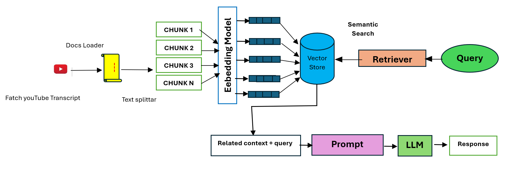

# YouTube Video Chatbot with RAG & Generative AI

A conversational AI chatbot that allows users to interact with YouTube video content through natural language queries. This project leverages Retrieval-Augmented Generation (RAG) and Google Gemini's Large Language Model (LLM) to provide accurate, contextual answers based on extracted video transcripts.

  
---

## Features

- **Automatic Transcript Extraction:** Fetches and processes YouTube video transcripts for content understanding.
- **Retrieval-Augmented Generation:** Uses LangChain with Google Generative AI embeddings to retrieve relevant transcript chunks.
- **Large Language Model:** Powered by Google Gemini LLM to generate human-like responses.
- **Interactive Chat Interface:** Built with Streamlit and `streamlit_chat` for a smooth conversational experience.
- **Contextual Responses:** Answers user queries strictly based on the video transcript context.
- **Session Management:** Maintains conversation history for context-aware interactions.

---

## Demo

  
*Interactive chat interface with YouTube video content*

---

# How to Use
- Enter a valid YouTube video URL in the sidebar.
- Click “Load Transcript” to fetch and process the transcript.
- Start typing your questions in the chat interface.
- Get answers derived from the video content!

---

## Technologies Used

- [LangChain](https://github.com/hwchase17/langchain) — for retrieval and LLM orchestration
- [Google Gemini LLM & Embeddings](https://developers.generativeai.google/) — large language model powering responses
- [Streamlit](https://streamlit.io/) — front-end user interface
- [YouTube Transcript API](https://github.com/jdepoix/youtube-transcript-api) — fetch video transcripts
- [streamlit_chat](https://github.com/AI4Finance-Foundation/Streamlit-Chat) — chat UI components

---

## Future Improvements

- Support multi-modal inputs (audio/video)
- Enhance response accuracy with improved retrieval strategies
- Integrate with more LLM providers for comparison
- Add user authentication for personalized chat logs

---

## Acknowledgments

Thanks to the open-source communities behind LangChain, Streamlit, and Google’s GenAI for enabling this project!

---

Feel free to contribute, report issues, or request features.

---
## 🙋‍♂️ Author
- Abhishek Agarwal
- 🌐 LinkedIn https://www.linkedin.com/in/abhishek07122002/
  
